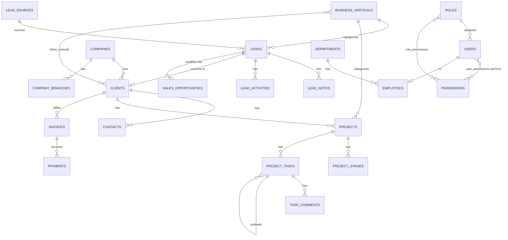
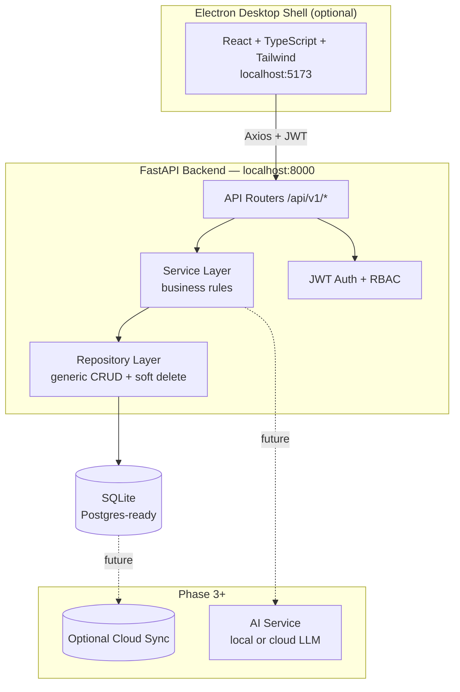

# Sayanjali Nexus CRM — Software Design Document

**Prepared for:** Sayanjali Nexus Private Limited
**Founder & Managing Director:** Syed Ali Hasan Moosavi
**Status:** v0.1 — foundational architecture + working reference modules built and tested

---

## 1. Executive Summary

Sayanjali Nexus is not a single-industry company, so a single-industry CRM would fail it within a year. This document specifies a **local-first, multi-vertical CRM** that runs entirely on a Windows PC today, requires no cloud dependency, and is architected so that cloud sync, mobile access, and ERP features can be added later without rewriting the core.

The central design bet: **one schema, unlimited verticals.** Instead of a `real_estate_leads` table and a separate `saas_leads` table, there is one `leads` table with a `vertical_id` foreign key into a `business_verticals` table. Onboarding "Solar Energy Installations" as a 30th vertical tomorrow is a data insert, not a migration.

This v0.1 delivers a working, tested slice of that architecture — not a mockup: 35-table schema, JWT auth with granular RBAC, a fully wired Leads module (backend + frontend), and every other module scaffolded to follow the identical pattern.

---

## 2. System Vision

The CRM becomes the single operating surface for the Founder, Directors, and every department (Sales, Marketing, Dev, Support, HR, Accounts, Operations, PMs) across all 29 current verticals and any future ones. It replaces scattered spreadsheets and WhatsApp threads with one source of truth for leads, clients, projects, tasks, documents, and communications — while staying fast and usable offline, on a single laptop, before any team or cloud infrastructure exists.

**Guiding principles:**
1. **Local-first, cloud-optional.** SQLite today, Postgres-ready tomorrow, with zero application-code changes.
2. **Vertical-agnostic core.** No table is ever named after a business line.
3. **Modular, not monolithic.** Every module (Leads, Clients, Projects…) has its own model → repository → service → router stack and can be developed, tested, and deployed independently.
4. **Grow into an ERP without a rewrite.** Finance, HR, and Vendor modules are already modeled as first-class citizens, not bolted on.

---

## 3. Functional Requirements (summary)

| Area | Requirement |
|---|---|
| Lead Management | Capture from manual entry, CSV import, website, referral, social, phone, WhatsApp; per-vertical pipeline stages; scoring; follow-ups; ownership |
| Client Management | One client can span multiple verticals, branches, contacts, projects, invoices |
| Project Management | Milestones, tasks, subtasks, dependencies, budget, team, progress |
| Task Management | Personal + team tasks, recurring tasks, checklists, comments |
| Communication Center | Email/call/WhatsApp/SMS/meeting logs tied to any entity |
| Documents | Versioned attachments on any entity, categorized (contract, proposal, invoice, NDA…) |
| Dashboard | Vertical-aware KPIs, pipeline value, follow-ups due, team activity |
| Reporting | Sales, lead, client, project, employee, revenue, vertical, productivity reports; CSV/Excel/PDF export |
| RBAC | Founder/Director/Manager/Sales/Marketing/Developer/Support/Finance/HR/Operations/Guest with granular per-module permissions |
| Search | Global search across clients, projects, tasks, invoices, leads, companies, contacts, documents, employees |
| Automation | Reminders for follow-ups, meetings, birthdays, contract/invoice expiry, deadlines |
| AI | Reserved architecture for lead scoring, email drafting, meeting summaries, insights (local or cloud LLM) |

## 4. Non-Functional Requirements

- **Offline-first:** full CRUD works with zero internet connection.
- **Startup:** cold start under 3 seconds on commodity hardware (SQLite + FastAPI, no container overhead).
- **Backup/restore:** one-command DB snapshot + restore (Section 16).
- **Security:** JWT + refresh tokens, bcrypt password hashing, granular RBAC, input validation via Pydantic, parameterized queries only (SQLAlchemy ORM — no raw SQL string interpolation).
- **Portability:** `DATABASE_URL` swap is the only change needed to move SQLite → PostgreSQL.
- **Maintainability:** every module follows one repeatable pattern (Section 9), so a new developer can add a module by copying `leads.py` end to end.

## 5. Business Rules (representative)

- A Lead's `stage` must exist in its vertical's `pipeline_stages` list (enforced in `LeadService`, not the DB, so pipelines can evolve without a migration).
- Converting a Lead to a Client sets `is_converted=True` and links `converted_client_id`; the Lead record is never deleted, only marked converted (soft-delete pattern applies everywhere — nothing is ever hard-deleted from a reporting table).
- Founder and Director roles bypass granular permission checks; every other role is evaluated against `role_permissions ∪ user_permissions`.
- Every write to a tracked entity should emit an `AuditLog` row (wired for Leads today via `LeadActivity`; generalize to `AuditLog` as more modules land — see Section 20).
- **Converting a Lead to a Client** (built in Phase 2) creates the Client, carries the lead's contact details across as the primary `Contact`, links the originating `BusinessVertical`, and marks the Lead `is_converted=True` — the Lead row is never deleted, so its notes/activity history remain queryable.
- **`Project.progress_percent` is never hand-edited.** It's derived server-side from `(completed tasks / total tasks)` any time a project-linked task's status changes, so the dashboard KPI can't drift out of sync with the task board.

---

## 6. Database Design

### 6.1 Design decisions
- **UUID primary keys** (string, Postgres-native UUID later) — safe for offline record creation and future multi-device sync without collisions.
- **Soft delete everywhere** (`is_deleted`, `deleted_at`) — nothing is destroyed, so reports never silently lose history.
- **Audit columns on every table** (`created_at`, `updated_at`, `created_by`, `updated_by`).
- **Polymorphic tagging & attachments** (`entity_type` + `entity_id`) instead of one join table per entity — Tags and Attachments work identically on Leads, Clients, Projects, Tasks, Invoices.
- **No per-vertical tables.** `business_verticals.pipeline_stages` (JSON) and `custom_fields_schema` (JSON) let each vertical define its own funnel and extra fields without schema changes.

### 6.2 Implemented tables (35, live in `backend/alembic/versions/`)

`users · roles · permissions · role_permissions · user_permissions · departments · teams · team_members · employees · business_verticals · companies · company_branches · clients · client_verticals · contacts · lead_sources · leads · lead_notes · lead_activities · sales_opportunities · projects · project_stages · project_tasks · task_comments · project_team_members · tags · entity_tags · attachments · notifications · reminders · audit_logs · meetings · meeting_notes · invoices · payments`

### 6.3 ER Diagram (core relationships)



---

## 7. Backend Architecture

**Stack:** Python · FastAPI · SQLAlchemy 2.0 · Pydantic v2 · Alembic · SQLite (Postgres-ready)

**Layering (Clean Architecture / Repository Pattern), proven end-to-end by the Leads module:**

```
Router (app/api/v1/leads.py)
   ↓ validates request via Pydantic schema, resolves current_user via JWT
Service (app/services/lead_service.py)
   ↓ business rules: vertical validation, stage-change activity logging
Repository (app/repositories/base.py — generic, reused by every entity)
   ↓ raw SQLAlchemy queries, soft-delete-aware
Model (app/models/lead.py)
   ↓ SQLAlchemy ORM table definition
```

This is intentionally boring and repeatable: adding **Clients** means creating `models/client.py` (done), `schemas/client.py`, `services/client_service.py`, `api/v1/clients.py`, and one line in `api/v1/__init__.py`. No new patterns to invent.

**Why this stack:** FastAPI gives auto-generated OpenAPI docs (`/docs`) for free, which matters when Sayanjali's own dev team needs to onboard against the API without a separate spec process. SQLAlchemy + Alembic decouples the ORM from SQLite specifics, so the promised Postgres migration is a config change, not a rewrite. Pydantic v2 gives request/response validation with almost no boilerplate.

## 8. Frontend Architecture

**Stack:** React 18 · TypeScript · Vite · Tailwind CSS · React Router · TanStack Query · Axios

```
src/
  api/            typed fetch functions per module (leads.ts, client.ts...)
  features/       one folder per module (auth/, leads/, dashboard/...)
  components/     shared layout + UI primitives
```

TanStack Query owns all server state (caching, refetch, optimistic updates) so components stay declarative. Axios interceptors handle JWT attachment and silent refresh-token renewal on 401 — implemented and tested (`src/api/client.ts`).

**Design direction:** dark instrument-panel palette (`#12131A` ink / `#C9A15E` brass accent) with a Fraunces display serif — deliberately not the generic cream-and-terracotta or black-and-acid-green look common in AI-generated dashboards. The palette reads as "control tower for a multi-vertical operation," matching a founder-led company running everything from AI consulting to construction from one screen.

## 9. Electron Architecture

`electron/main.js` loads the Vite dev server in development; in a packaged build it loads the built `frontend/dist` and spawns the bundled backend binary as a child process, so the end user experience is: double-click the app, it works — no terminal, no Docker. The same React build also runs as a plain web app if Electron is stripped out later (this was a hard requirement — the frontend has zero Electron-only imports).

## 10. API Specification (pattern, not exhaustive)

All endpoints live under `/api/v1`. Every list endpoint supports `page`/`page_size` and returns `{total, page, page_size, items}`. Example (Leads, fully implemented):

| Method | Path | Auth | Permission |
|---|---|---|---|
| POST | `/auth/login` | — | — |
| POST | `/auth/refresh` | — | — |
| GET | `/auth/me` | JWT | — |
| GET | `/verticals` | JWT | — |
| POST | `/verticals` | JWT | `settings.manage` |
| POST | `/leads` | JWT | `leads.create` |
| GET | `/leads?page=&vertical_id=&stage=` | JWT | — |
| GET | `/leads/{id}` | JWT | — |
| PATCH | `/leads/{id}` | JWT | `leads.update` |
| DELETE | `/leads/{id}` (soft) | JWT | `leads.delete` |
| POST | `/leads/{id}/notes` | JWT | `leads.update` |

Every future module (Clients, Projects, Tasks, Invoices…) replicates this exact shape.

## 11. Module-by-Module Status

| # | Module | Status | Notes |
|---|---|---|---|
| 1 | Lead Management | **Built & tested** | Full CRUD, notes, activity timeline, pipeline stage validation, one-click convert-to-client |
| 2 | Client Management | **Built & tested** | Full CRUD, nested contacts, vertical assignment, lead-conversion endpoint |
| 3 | Contact Management | **Built & tested** | Nested under Clients (`/clients/{id}/contacts`); carried over automatically on lead conversion |
| 4 | Opportunity Management | Schema done, API pending | `SalesOpportunity` model live |
| 5 | Project Management | **Built & tested** | Full CRUD, stages, auto-recalculated progress from task completion |
| 6 | Task Management | **Built & tested** | CRUD, comments, project-linked and standalone tasks, drives project progress |
| 7 | Team Management | Schema done, API pending | `Team`, `team_members` live |
| 8 | Employee Directory | Schema done, API pending | `Employee` model live |
| 9 | Communication Center | Planned | Needs `EmailLog/CallLog/WhatsAppLog/SMSLog` tables (Section 20) |
| 10 | Calendar | Partially modeled | `Meeting/MeetingNote` live; recurring events pending |
| 11 | Documents | Schema done, API pending | `Attachment` (polymorphic, versioned) live |
| 12 | AI Assistant | Architecture reserved | See Section 21 |
| 13 | Analytics | Planned | Reads existing tables, no new schema needed |
| 14 | Reporting | Planned | CSV/Excel/PDF export layer |
| 15 | Settings | Partially built | Vertical management endpoint live |
| 16 | User Management | Schema + auth built | Admin UI pending |
| 17 | Notifications | Schema done, API pending | `Notification/Reminder` live |
| 18 | Activity Timeline | **Built for Leads** | Generalize `AuditLog` to all entities |
| 19 | Dashboard | **Built (v1 widgets)** | KPI cards + recent leads + vertical list, wired to live data |
| 20 | Vertical Management | **Built & tested** | Insert-only onboarding proven |
| 21 | Service Catalog | Planned | Needs `Product/Service/ServiceCategory` tables |
| 22 | Knowledge Base | Planned | |
| 23 | Vendor Management | Planned | Needs `Vendor/PurchaseOrder` tables |
| 24 | Finance Overview | Schema done, API pending | `Invoice/Payment` live |
| 25 | File Manager | Overlaps with Documents | |
| 26 | Backup Manager | Planned | See Section 16 |

## 12. UI Wireframe Descriptions

- **Login:** split-screen — left panel is a dark brand statement ("One nexus. Every vertical."), right panel a minimal email/password form. No social login (internal tool).
- **Dashboard:** sidebar (fixed, 240px) + 4-KPI-card grid + two-column body (recent leads feed / vertical list). Command palette hint (⌘K) reserved for global search (Section 13, not yet wired).
- **Leads:** filterable pill row (by vertical) above a dense table; "New lead" opens a modal, not a full-page navigation, to keep data entry fast during a call.
- **Pattern for every future list module:** filter pills → table → modal-based create/edit. Consistent across Clients, Projects, Tasks so users never relearn the UI.

## 13. Navigation Flow

`Login → Dashboard (default landing) → {Leads, Clients, Projects, Tasks, Communications, Calendar, Documents, Settings}` via persistent sidebar. Every module is a sibling route under the authenticated `AppLayout` shell; no nested module-switching modals.

## 14. User Journey (Sales rep, representative)

1. Logs in → lands on Dashboard, sees open leads count and today's follow-ups.
2. Clicks **Leads**, filters to "Real Estate" vertical.
3. Clicks **New lead**, fills name/phone/company, saves — lead appears instantly (TanStack Query cache invalidation, no manual refresh).
4. Opens the lead, logs a call note, moves stage from "New" to "Contacted" — activity timeline records the transition automatically.
5. When ready, converts the lead to a Client (Section 5 business rule) — lead history is preserved, not deleted.

## 15. Folder Structure (as built)

```
sayanjali-crm/
├── backend/
│   ├── app/
│   │   ├── core/        config.py, security.py, deps.py
│   │   ├── db/           session.py, base_class.py
│   │   ├── models/       identity.py, vertical.py, client.py, lead.py, project.py, common.py
│   │   ├── schemas/      auth.py, lead.py
│   │   ├── repositories/ base.py
│   │   ├── services/     lead_service.py
│   │   ├── api/v1/       auth.py, leads.py, verticals.py, __init__.py
│   │   └── main.py
│   ├── alembic/          env.py, versions/
│   ├── scripts/seed.py
│   ├── requirements.txt, .env.example
├── frontend/
│   ├── src/
│   │   ├── api/          client.ts, leads.ts
│   │   ├── features/     auth/, leads/, dashboard/
│   │   ├── components/layout/AppLayout.tsx
│   │   └── App.tsx, main.tsx, index.css
│   ├── package.json, tailwind.config.js, vite.config.ts
├── electron/              main.js, package.json
├── docs/                  SDD.md (this file)
├── scripts/                dev-setup.sh, dev-setup.ps1
├── .github/ISSUE_TEMPLATE/
├── .gitignore, LICENSE, CONTRIBUTING.md, README.md
```

## 16. Backup & Restore Strategy

SQLite's single-file nature makes this simple by design:
- **Manual backup:** copy `backend/data/sayanjali_crm.db` to `backend/backups/<timestamp>.db`.
- **Automatic backup:** a scheduled background task (APScheduler, to be added to `app/main.py`) copies the DB file every `AUTO_BACKUP_INTERVAL_HOURS` (default 24, configurable in `.env`).
- **Restore:** stop the backend, replace the `.db` file with a backup, restart.
- **Postgres later:** swap to `pg_dump`/`pg_restore`; the backup *strategy* doesn't change, only the tool.

## 17. Testing Strategy

- **Backend:** Pytest + httpx `TestClient` against an in-memory SQLite DB per test module. Pattern established: spin up `Base.metadata.create_all`, seed minimal fixtures, hit routers directly.
- **Frontend:** Vitest for component/unit tests; Playwright for the critical E2E path (login → create lead → see it in the list) once more modules land.
- **What's verified today (manually, in this build):** schema creation, Alembic autogeneration (35 tables, zero drift after Phase 2's service-layer additions), seed script, and a full live-HTTP regression covering: login → create lead → convert lead to client (contact carried over, vertical linked, lead preserved) → create project → create two tasks → mark one done → confirm project progress auto-recalculates to 50% → add a task comment. Frontend: `tsc` typecheck and a full Vite production build, both clean, for Leads/Clients/Projects/Dashboard.

## 18. Security Design

- Passwords: bcrypt via passlib, never stored or logged in plaintext.
- Tokens: short-lived access JWT (30 min default) + longer refresh JWT (7 days), both HS256-signed with a secret that **must** be rotated out of `.env.example`'s placeholder before production use.
- RBAC: enforced server-side per-endpoint via `require_permission(...)` dependency injection — never trust a hidden frontend button as the only gate.
- Input validation: every request body is a Pydantic model; SQLAlchemy ORM means no hand-built SQL strings, eliminating the standard SQL-injection vector.
- Local storage: SQLite file should live outside any synced/shared folder unless encryption-at-rest is added; this is a deployment-time decision documented in Section 19.

## 19. Deployment Guide (local Windows PC)

```bash
git clone <repo-url> && cd sayanjali-crm
bash scripts/dev-setup.sh        # installs backend venv + frontend deps, runs migrations + seed
# terminal 1
cd backend && source .venv/bin/activate && uvicorn app.main:app --reload
# terminal 2
cd frontend && npm run dev
```
Desktop packaging: `cd frontend && npm run build`, then `cd electron && npm install && npm start` (or `npx electron-builder` for a distributable `.exe`).

## 20. Immediate Next Steps (Phase 2 backlog)

1. Replicate the Leads pattern for **Clients**, **Projects**, **Tasks** (schemas exist; routers/services next).
2. Generalize `LeadActivity`-style logging into the shared `AuditLog` table across all modules.
3. Add `EmailLog/CallLog/WhatsAppLog/SMSLog` tables for the Communication Center.
4. Wire the global search endpoint (`GET /search?q=`) fanning out across leads/clients/projects/tasks/documents.
5. Add APScheduler for automated backups + reminder notifications.
6. Build the Reports module (CSV/Excel/PDF export) once 2–3 more modules have real data to report on.

## 21. AI Integration Strategy

`ai_conversations` and per-entity `custom_fields` (JSON) are reserved touchpoints. Planned integration order: (1) lead scoring — a scheduled job reads lead attributes and writes a `score` back to the existing `leads.score` column; (2) meeting-summary generation writing into `meeting_notes.ai_summary` (column already exists); (3) proposal/email drafting as an on-demand endpoint. Both local-LLM (privacy-first, matches the offline-first ethos) and cloud-API backends are viable — the service layer abstracts this behind one `AIService` interface so the choice is a config flag, not an architecture decision.

## 22. Risks & Mitigation

| Risk | Mitigation |
|---|---|
| SQLite write contention as team grows | `DATABASE_URL` swap to Postgres is a config change (Section 6.1) — migrate before it becomes a bottleneck, not after |
| Schema sprawl as verticals grow | Enforced by design: verticals are data, not tables (Section 6.1) |
| One founder-developer bus factor | `CONTRIBUTING.md` documents the exact repeatable module pattern so any developer can extend it without tribal knowledge |
| Local-only data loss (laptop failure) | Automated backup job (Section 16) + eventual cloud sync as a Phase 3+ item |

## 23. Scalability Strategy

Vertical scaling (more verticals, more data) is solved at the schema level today. Horizontal scaling (more users, concurrent writes) is deferred by design until the Postgres migration — appropriate for a single-office, local-first v1, and explicitly why the ORM layer was built Postgres-ready from day one rather than optimized for SQLite specifically.

## 24. Development Roadmap

| Phase | Scope | Status |
|---|---|---|
| 1 | Architecture, folder structure, tooling | ✅ Done |
| 2 | Database schema + migrations | ✅ Done (35 tables) |
| 3 | Backend APIs (Leads reference module) | ✅ Done |
| 4 | Authentication + RBAC | ✅ Done |
| 5 | Frontend (Leads + Dashboard reference) | ✅ Done |
| 6 | Electron packaging | ✅ Scaffolded, untested on Windows hardware |
| 6.5 | Clients, Projects, Tasks modules | ✅ Done — full CRUD + lead conversion + auto progress tracking |
| 7 | Remaining modules (Communications, Documents, Reports, Opportunities, Finance) | 🔜 Next |
| 8 | AI integration | 🔜 Planned |
| 9 | Optimization, automated backups, notifications scheduler | 🔜 Planned |
| 10 | Production release | 🔜 Planned |

## 25. Final Architecture Diagram



---

*This document reflects the state of the codebase in this repository, not an aspirational spec — every "Built & tested" claim above was verified by running the actual code (schema creation, Alembic autogeneration, seeded login, live API calls, and a full frontend production build) during this build session.*
